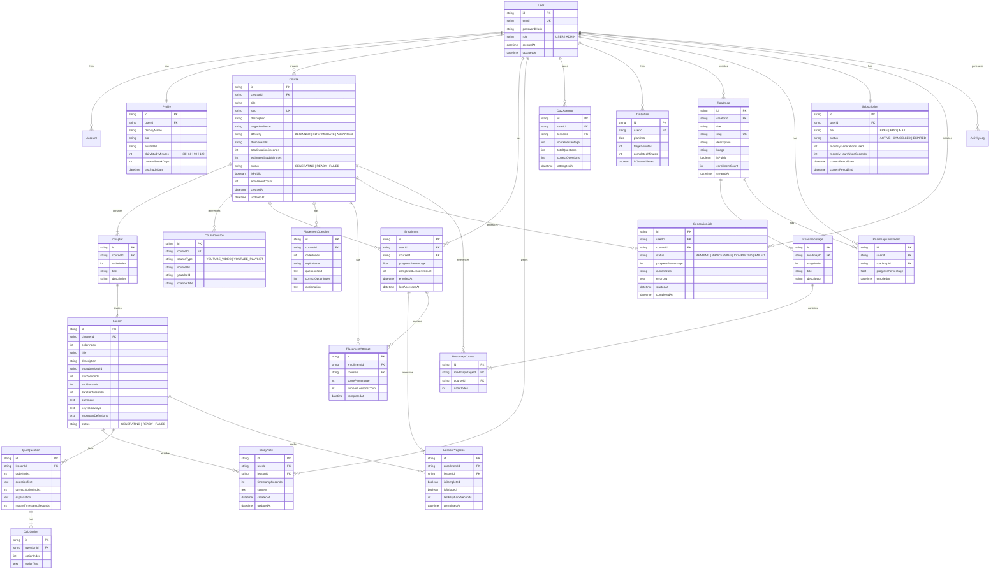

# Database Entity Relationship Diagram (ERD)

This document details the complete relational database architecture supporting the platform.

---

### Entity Relationship Diagram (Mermaid)

```mermaid
erDiagram
    User ||--o{ Account : has
    User ||--|| Profile : has
    User ||--o{ Course : creates
    User ||--o{ Enrollment : has
    User ||--o{ StudyNote : writes
    User ||--o{ QuizAttempt : takes
    User ||--o{ DailyPlan : has
    User ||--o{ Roadmap : creates
    User ||--o{ RoadmapEnrollment : has
    User ||--|| Subscription : has
    User ||--o{ GenerationJob : initiates
    User ||--o{ ActivityLog : generates

    Course ||--|{ Chapter : contains
    Course ||--o{ CourseSource : references
    Course ||--o{ Enrollment : has
    Course ||--o{ PlacementQuestion : has
    Course ||--o{ PlacementAttempt : has
    Course ||--o{ GenerationJob : generates

    Chapter ||--|{ Lesson : divides

    Lesson ||--o{ StudyNote : attaches
    Lesson ||--o{ QuizQuestion : tests
    Lesson ||--o{ LessonProgress : tracks

    QuizQuestion ||--|{ QuizOption : has

    Roadmap ||--|{ RoadmapStage : divides
    RoadmapStage ||--|{ RoadmapCourse : contains
    Course ||--o{ RoadmapCourse : references
    Roadmap ||--o{ RoadmapEnrollment : has

    Enrollment ||--o{ LessonProgress : maintains
    Enrollment ||--o{ PlacementAttempt : records

    User {
        string id PK
        string email UK
        string passwordHash
        string role "USER | ADMIN"
        datetime createdAt
        datetime updatedAt
    }

    Profile {
        string id PK
        string userId FK
        string displayName
        string bio
        string avatarUrl
        int dailyStudyMinutes "30 | 60 | 90 | 120"
        int currentStreakDays
        datetime lastStudyDate
    }

    Course {
        string id PK
        string creatorId FK
        string title
        string slug UK
        string description
        string targetAudience
        string difficulty "BEGINNER | INTERMEDIATE | ADVANCED"
        string thumbnailUrl
        int totalDurationSeconds
        int estimatedStudyMinutes
        string status "GENERATING | READY | FAILED"
        boolean isPublic
        int enrollmentCount
        datetime createdAt
        datetime updatedAt
    }

    CourseSource {
        string id PK
        string courseId FK
        string sourceType "YOUTUBE_VIDEO | YOUTUBE_PLAYLIST"
        string sourceUrl
        string youtubeId
        string channelTitle
    }

    Chapter {
        string id PK
        string courseId FK
        int orderIndex
        string title
        string description
    }

    Lesson {
        string id PK
        string chapterId FK
        int orderIndex
        string title
        string description
        string youtubeVideoId
        int startSeconds
        int endSeconds
        int durationSeconds
        text summary
        text keyTakeaways
        text importantDefinitions
        string status "GENERATING | READY | FAILED"
    }

    QuizQuestion {
        string id PK
        string lessonId FK
        int orderIndex
        text questionText
        int correctOptionIndex
        text explanation
        int replayTimestampSeconds
    }

    QuizOption {
        string id PK
        string questionId FK
        int optionIndex
        text optionText
    }

    PlacementQuestion {
        string id PK
        string courseId FK
        int orderIndex
        string topicName
        text questionText
        int correctOptionIndex
        text explanation
    }

    Enrollment {
        string id PK
        string userId FK
        string courseId FK
        float progressPercentage
        int completedLessonsCount
        datetime enrolledAt
        datetime lastAccessedAt
    }

    LessonProgress {
        string id PK
        string enrollmentId FK
        string lessonId FK
        boolean isCompleted
        boolean isSkipped
        int lastPlaybackSeconds
        datetime completedAt
    }

    StudyNote {
        string id PK
        string userId FK
        string lessonId FK
        int timestampSeconds
        text content
        datetime createdAt
        datetime updatedAt
    }

    QuizAttempt {
        string id PK
        string userId FK
        string lessonId FK
        int scorePercentage
        int totalQuestions
        int correctQuestions
        datetime attemptedAt
    }

    PlacementAttempt {
        string id PK
        string enrollmentId FK
        string courseId FK
        int scorePercentage
        int skippedLessonsCount
        datetime completedAt
    }

    DailyPlan {
        string id PK
        string userId FK
        date planDate
        int targetMinutes
        int completedMinutes
        boolean isGoalAchieved
    }

    Roadmap {
        string id PK
        string creatorId FK
        string title
        string slug UK
        string description
        string badge
        boolean isPublic
        int enrollmentCount
        datetime createdAt
    }

    RoadmapStage {
        string id PK
        string roadmapId FK
        int stageIndex
        string title
        string description
    }

    RoadmapCourse {
        string id PK
        string roadmapStageId FK
        string courseId FK
        int orderIndex
    }

    RoadmapEnrollment {
        string id PK
        string userId FK
        string roadmapId FK
        float progressPercentage
        datetime enrolledAt
    }

    Subscription {
        string id PK
        string userId FK
        string tier "FREE | PRO | MAX"
        string status "ACTIVE | CANCELLED | EXPIRED"
        int monthlyGenerationsUsed
        int monthlyHoursUsedSeconds
        datetime currentPeriodStart
        datetime currentPeriodEnd
    }

    GenerationJob {
        string id PK
        string userId FK
        string courseId FK
        string status "PENDING | PROCESSING | COMPLETED | FAILED"
        int progressPercentage
        string currentStep
        text errorLog
        datetime startedAt
        datetime completedAt
    }
```

